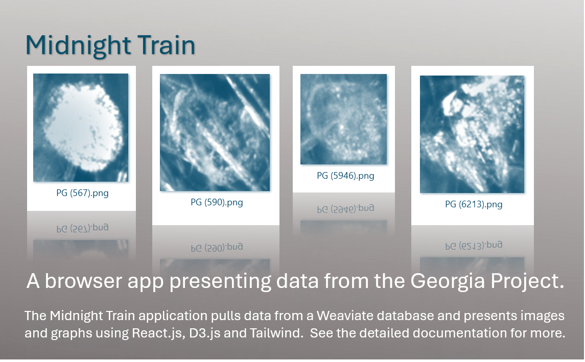

  

## Content. 
[Really quick start.](#really-quick-start) • 
[Quick start.](#quick-start) • 
[Slow start.](#slow-start) • 
[Contributions](#contributions) • 
[Known issues](#known-issues) • 
[Contact info](#contact-info)

## Really quick start. 
See the Live Demo now by clicking here....  TBD

## Quick start. 
Get the code by cloning.
Open a command window and put in the following commands. 
 git clone https://github.com/KatherineMossDeveloper/MidnightTrain.git
 cd MidnightTrain
Open the project in Pycharm and run these commands in a terminal window.
 npm install
 npm run dev
Open http://localhost:3000 in your browser.
When the app opens, click on the images in the  Image Gallery on the left. 

## Slow start.  
This project was inspired by a research paper:  Salami, H., McDonald, M. A., Bommarius, A. S., Rousseau, R. W., & Grover, M. A. (2021). [In Situ Imaging Combined with Deep Learning for Crystallization Process Monitoring: Application to Cephalexin Production](https://doi.org/10.1021/acs.oprd.1c00136). *Organic Process Research & Development*, 25, 1670–1679. 

The scientists who wrote the paper trained ResNet models with ImageNet weights on the OpenCrystalData dataset. The models were trained to do binary classification of images of crystals, designating them as either CEX (a.k.a., “cephalexin antibiotic,” a good thing) or PG (a.k.a. “phenylglycine,” a bad thing).  

The Georgia Project, in this same GitHub site, recreates their work, then it stores details in a database.  

Midnight train, in turn, pulls these details from the database and creates graphs in order to study the dataset.  Here is Midnight Train's detailed documentation.  
[Go to the main doc file](docs/maindoc.md)    

## Contributions.  
If you found an issue or would like to make a suggestion for an improvement to the code or documentation, please click on the issue tab on the project page and leave me a note.  If you like this project, leave a star.  

## Known issues.  
None.  

## Contact info.                                                                     
For more details about this project, feel free to reach out to me at katherinemossdeveloper@gmail.com or my account on [LinkedIn](https://www.linkedin.com/pub/katherine-moss/3/b49/228) .  
My time zone is EST in the U.S.

[back to top](#content) 

