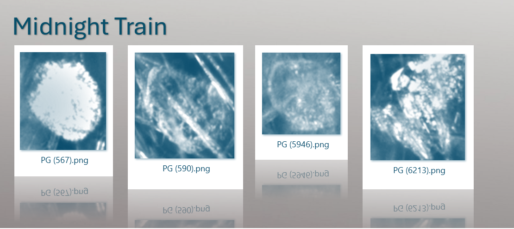  

## Overview.
<a href="#the-introduction">
  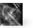 The introduction.
</a> 
<a href="#d3">
   D3.js
</a> 
<a href="#cam-overlays">
   CAM overlays
</a> 
<a href="#D3-accordion">
   D3 accordion
</a> 
<a href="#Screen-tool-CAM-overlays-D3-accordion">
   Screen tool:  CAM overlays + the D3.js accordion
</a> 
<a href="#Screen-tool-CAM-slider">
   Screen tool:  CAM image slider
</a>   
<a href="#Feature-vectors">
   Feature vectors
</a> 
<a href="#Feature-vector-and-Weaviate-database">
   Feature vectors + Weaviate database
</a> 
<a href="#PCA">
   Principal component analysis
</a> 
<a href="#Kmeans">
   Kmeans
</a> 
<a href="#Screen-tool-PCA-Kmeans">
   Screen tool:  PCA + Kmeans scatter plot of feature vectors 
</a> 
<a href="#Force-directed-graph">
   Force directed graphs
</a> 
<a href="#HNSW">
   HNSW nearest neighbor algorithm 
</a> 
<a href="#Screen-tool-Force-directed-graph-kmeans">
   Screen tool:  Force directed graphs + HNSW + Kmeans
</a> 
<a href="#Histograms-and-entropy">
   Histograms and Entropy
</a> 
<a href="#Screen-tool-Histogram">
   Screen tool:  Histogram
</a> 
<a href="#Screen-tool-Entropy-kmeans">
   Screen tool:  Entropy scatter plots + Kmeans
</a> 
<a href="#React-tailwind-chatGPT-Vercel">
    React + Tailwind + chatGPT + Vercel
</a> 

## Implementation.
<a href="#Quick-start-instructions">
   Quick start instructions
</a> 
<a href="#pseudo-3d-images">
   Pseudo 3D images
</a> 
<a href="#PCA-in-3D">
   PCA in 3D 
</a> 
<a href="#Entropy">
   Entropy
</a> 
<a href="#flow">
   Flow of the code
</a> 
<a href="#hnsw-notes">
   HNSW
</a> 
<a href="#image-slider-notes">
   The Image Slider
</a> 
<a href="#log">
   The Log
</a> 
<a href="#cam-generation">
   The CAM overlay generation process 
</a> 
<a href="#JSON-files">
   JSON files
</a> 
<a href="#Weaviate-database">
   Weaviate database
</a> 

## The introduction
I am a software developer doing an independent study into using machine learning to identify crystallization in images. I found an interesting dataset and a really good research paper on the topic, so I wrote code to train on the data, and presented the data, using the paper for guidance. I am posting the code and results here in the hope that others will also find it interesting.

I found the crystal image dataset on Kaggle. I decided to work with it because there were enough images to train with, and the images are all high quality. Here is the hyperlink to the dataset: OpenCrystalData Crystal Impurity Detection.

The dataset I found was collected using Mettler-Toledo, LLC, (MT) instrumentation. While this is not a research paper, where one would typically make an affiliation statement, I should mention that I worked at MT on their vision products for years. However, I am no longer affiliated with the Company and am not necessarily endorsing their products here, nor have I used any intellectual property owned by MT.

I chose crystallization in images because I think it is an important area of A.I. Other corners of the A.I. world, like LLM’s, video creation, and robotics, have grabbed headlines these days, but I would argue that the detection and categorization of crystallization in images is just as important because it is used in food processing, drug discovery, quality control in manufacturing, etc. It would be good to have more developers and data scientists interested in this part of A.I.

In the KatherineMossDeveloper GitHub website, there are two related projects, the Georgia Project and Midnight Train. 

The Georgia Project was inspired by a research paper:  Salami, H., McDonald, M. A., Bommarius, A. S., Rousseau, R. W., & Grover, M. A. (2021). In Situ Imaging Combined with Deep Learning for Crystallization Process Monitoring: Application to Cephalexin Production. Organic Process Research & Development, 25, 1670–1679.

The scientists who wrote the paper trained ResNet models with ImageNet weights on the OpenCrystalData dataset. The models were trained to do binary classification of images of crystals, designating them as either CEX (a.k.a., “cephalexin antibiotic,” a good thing) or PG (a.k.a. “phenylglycine,” a bad thing).  One purpose of the paper was to determine if an impurity, PG, shows up during cephalexin antibiotic production. This would allow scientists to stop the process early, saving time and resources. This is the task that the A.I. model addresses.

The Georgia Project recreates their work, then it stores details in a database.  Midnight train, in turn, pulls these details from the database and creates graphs in order to study the dataset. 

<a href="#">
  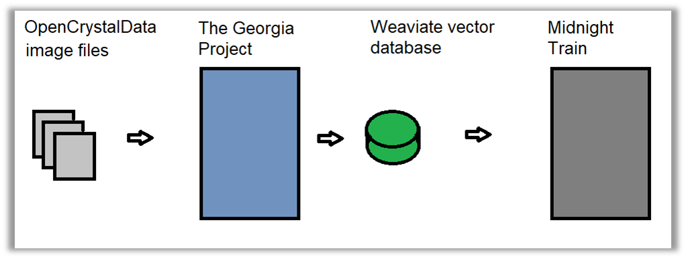
</a> 

  <em>
  Figure 1. Overview of the Georgia Project and Midnight Train. Image by author. 
  </em>

The goals for Midnight Train are to explore visualization with React in general and D3.js in particular.  I also wanted to see how the output from a trained model would benefit from support from a vector database.  

[back to top](#Overview)   

## D3
D3.js is a free and open-source JavaScript visualization library that presents data in ways that are attractive, unusual, and often animated.  Midnight train has a number of interactive screen components that either use the D3.js library or are inspired by the D3.js visualization.  These include a force directed graph, scatter plot animation, a histogram, and an “accordion” view of images.  

By the way, I ran across the D3.js library years ago, so I am surprised to see that its popularity is escalating, as this graph of daily downloads suggests.  

<a href="#">
  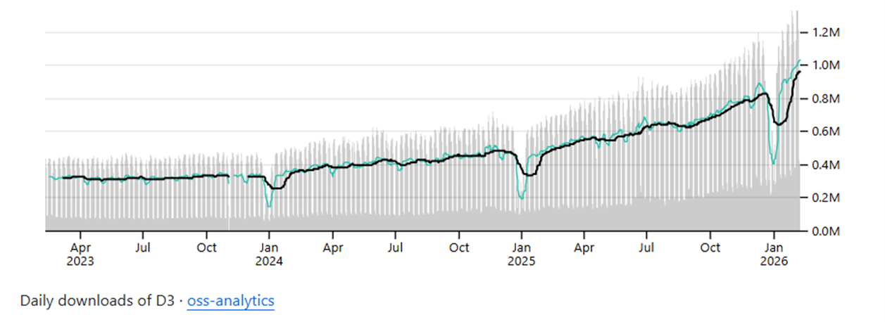
</a> 

	<em>
  		Figure 2. D3.js downloads in recent years. Image credit:  Mike Bostock.  
	</em>

For more on D3 on GitHub, visit [D3](https://github.com/d3/d3?tab=readme-ov-file).  
For more on D3.js, visit D3 by Observable, visit [D3](https://d3js.org/).  
For more on the creator of D3.js, visit [Mick Bostock](https://bost.ocks.org/mike/).  

[back to top](#Overview)   

## CAM overlays
Classification activation mapping, known usually by it initials “CAM,” is a way to show where a trained A.I. model gave the most weight to the features in an image when classifying the image.  Here is a nice clear example from the Johannes Schusterbauer blog, using an image of a meerkat as an example.  The model was tasked with classifying the image as being of a meerkat or not.  

The image on the left is the original photo.  The image on the right is the CAM overlay, which shows the weights applied by the A.I. model as colors over the original image.  The red areas had the highest weights.  The purple areas had the lowest weights.  

We know from the CAM overlay that the model was “looking” in the right areas when making a classification.  The red colors are over the animal, instead of mistakenly over the background, for example.  Going further, we know that it was looking more at the neck than the eyes when classifying this as an image of a meerkat.  

<a href="#">
  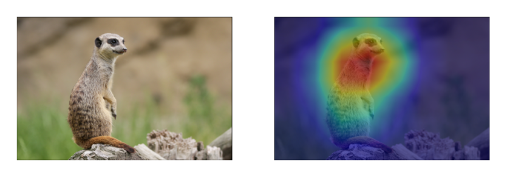
</a> 

  <em>
  Figure 3. Photo of meerkat original and with a CAM overlay.  Image credit:  Johannes Schusterbauer. 
  </em>

For more, visit [Schusterbauer](https://johfischer.com/2022/01/27/class-activation-maps).    

I wanted to apply this technique to the OpenCrystalData dataset.  In my first attempts, I used the traditional “rainbow” color scheme, as seen above with the meerkat.  The OpenCrystalData dataset images with these CAM overlays were aesthetically pleasing, but too visually complex to tie the colorization back to crystal structures, or the classification, which were the goals -- assuming that these goals could be achieved.  Here is an example image of my first attempt. 

<a href="#">
  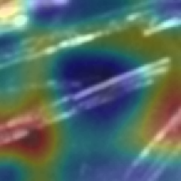
</a> 

  <em>
  Figure 4. CEX (6819).png with rainbow color scheme and showing all colorization (weight threshold > 0).  Image by author. Data source: OpenCrystalData. 
  </em>

After several attempts, I decided to not use the typical rainbow color scheme, but simplify the colorization down to one or two colors. When choosing the colors, pink and purple seemed more pleasing, probably because they reminded me of H&E staining, however irrelevant that is.  I also set up a threshold, so that only the areas with the highest weights would have the overlay colors applied, rather than have the whole image covered with color.  Here is an example using the same image, CEX (6819).png.  The original is on the left.  The original with the pink and purple CAM overlay applied is on the right.  For more, see The CAM overlay generation process, in the implementation notes. 

<a href="#">
  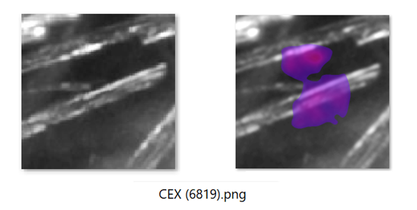
</a> 

  <em>
  Figure 5. Original image on the left; CAM overlay on the right. Image by author. Data source: OpenCrystalData.
  </em>

[back to top](#Overview)   

## D3 accordion
Some years ago, I found an interactive visualization online in the The New York Times called “Front Row to Fashion”.  The technology was D3.js.  I was impressed that this ‘accordion’ style of visualization, on the one hand, showed partial images of clothing, and yet imparted new information about the collection.  Specifically, one could see the overall style of a designer, rather than focus on the individual pieces; i.e. one can see the forest, rather than the trees.  Here is an example using six of those collections.  
<a href="#">
  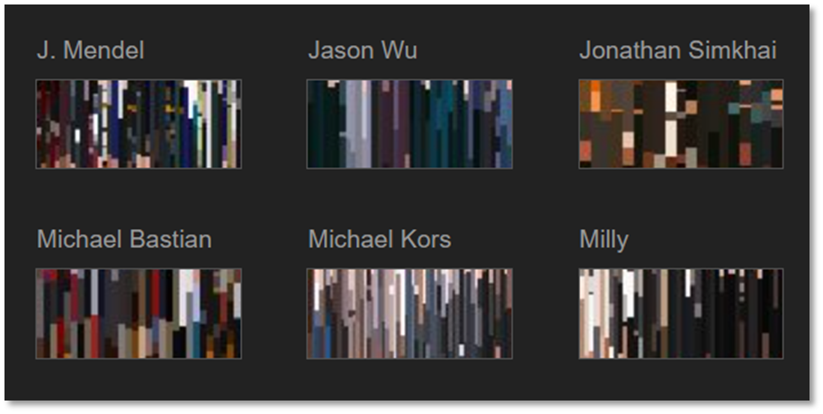
</a> 

  <em>
  Figure 6. Front Row to Fashion. Image credit:  New York Times. 
  </em>

For more, visit [New York Times](https://www.nytimes.com/newsgraphics/2014/02/14/fashion-week-editors-picks/index.html).  

[back to top](#Overview)   

## Screen tool CAM overlays D3 accordion
So, how could scientific visualization benefit from this idea?  As a developer, I saw an opportunity here, so I put two accordion style visualizations in Midnight Train, as seen below.  The images are of the CAM overlays.  The top one is of CEX images, and the bottom is of PG images.  The pink and purple areas are where the model mostly “focused on” when doing classification of the images.  The accordions are animated.  A mouse hover opens each image fully.  Note that when you look at these partial images, the pink overlays are more uniform in the CEX images, and the background of the PG images is noisier.  We can see the forests. 

<a href="#">
  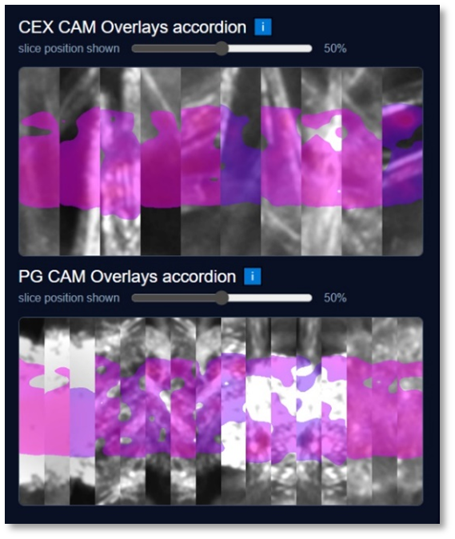
</a> 

  <em>
  Figure 7. The accordion screen controls in Midnight Train.  Image by author. Data source: OpenCrystalData.
  </em>

[back to top](#Overview)  

## Screen tool CAM slider
The CAM image slider, as seen below, shows both the original image and CAM overlay image together.  Instead of being side-by-side, they both take up the space of one image, with a horizontal click-and-drag functionality.  The user can drag the bar to the right and left to study where the CAM overlay is placed.  

<a href="#">
  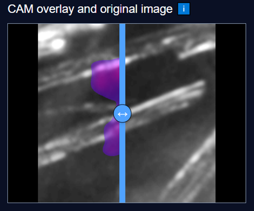
</a> 

  <em>
  Figure 8. The CAM Image Sliders.  Image by author.  Data source: OpenCrystalData.
  </em>

[back to top](#Overview)  

## Feature vectors
As mentioned elsewhere, the Georgia Project produced many pieces of information after training on the OpenCrystalData dataset.  This included metadata, of course, like the confidence percent that the model had when determining the classification of an image. However, the most important data was perhaps not the meta data, but the feature vectors that the model created in order to make the classification.  Feature vectors contain numerical weights calculated by the model.  Different layers of the model create weights for different sized areas of a given image.  Here is a visualization of these weights when a model was creating feature vectors for images of human faces.  

<a href="#">
  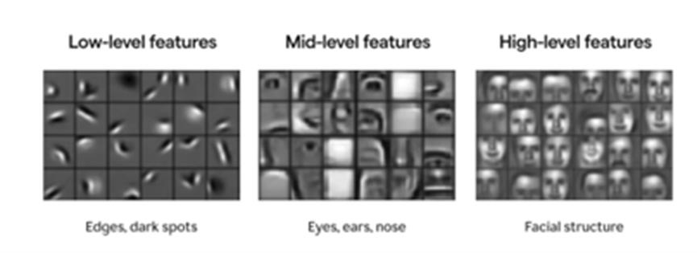
</a> 

  <em>
  Figure 9. The model is trained on larger and larger areas of images.  Image source:  datascience.stackexchange.com.
  </em>

For more, visit [stackexchange](https://datascience.stackexchange.com/questions/77830/how-do-stacked-cnn-layers-work).

[back to top](#Overview)  

## Feature vector and Weaviate database
Storing such a vector, with many dimensions, is not a typical storage consideration for a relational database.  A typical SQL database does not have a vector datatype.  This led me to vector databases.  My plan was that such a database would allow me to bridge the gap between the Georgia Project, which produced data, and the Midnight Train Project, which presents data.  Hence, the pun about “Midnight Train to Georgia.” 

For more on Weaviate, visit [Weaviate](https://weaviate.io/).  
For more on the song, visit [Midnight Train to Georgia](https://en.wikipedia.org/wiki/Midnight_Train_to_Georgia).  

[back to top](#Overview)  

## PCA
People can see only three dimensions or less, so some algorithms were created to reduce the number of dimensions down to two or three.  Principle Component Analysis (PCA) is one of the “dimensionality reduction” algorithms.  Some details are lost reducing dimensions, but often new insights are gained.  

As mentioned above, the model creates a feature vector for each image.  The feature vector has many, many dimensions.  PCA is used in Midnight Train to reduce the feature vectors for the images down to two dimensions.  Since PCA gives us an X and a Y coordinate for each image, they can be plotted in a 2D graph.  Similar images, depicted as circles, in the OpenCrystalData dataset are found near each other when the PCA coordinates are plotted, which implies that PCA is a good algorithm to use here.  

For more on PCA, visit [ScienceInsights](https://scienceinsights.org/what-is-principal-component-analysis-how-it-works/).  
It has a cool animation that shows how Kmeans centroids ‘find’ each group.  

[back to top](#Overview).

## Kmeans
Kmeans clustering is an algorithm that can show us how data is grouped. It does this ‘unsupervised,’ meaning that the data is not labeled, as belonging to one group or another.  The author of the algorithm designates the number of groups to ‘find.’  The algorithm creates center points, or centroids, and then scatters them randomly.  Then it computes the distance between every centroid and the plotted points.  With each iteration of the algorithm, the centroids move to their respective final positions.  The plotted points closest to a given centroid ‘belongs’ to that centroid’s group.  

For more on Kmeans, visit [Wohlenberg](https://medium.com/data-science/three-versions-of-k-means-cf939b65f4ea).  

[back to top](#Overview)  

## Screen tool PCA Kmeans
Putting these ideas together with our images, we move from multi-dimensional feature vectors to two dimensional, plottable, points with PCA.  Then Kmeans clustering marks each image as being part of a group.  After assigning a color to each Kmeans group, we have a visualization of how the images are related – or not.  As noted previously, human judgment is required to determine how many groups there should be.  After experimenting, I settled on 4. 

<a href="#">
  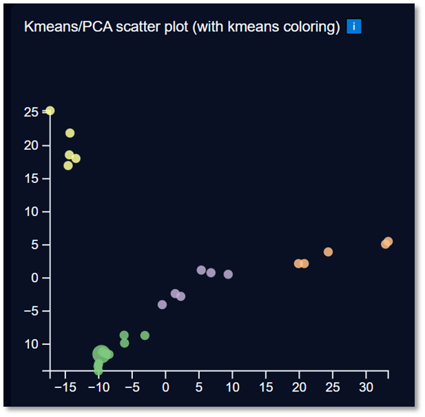
</a> 

  <em>
  Figure 10. The Kmeans/PCA scatter plot.  Image by author. 
  </em>

[back to top](#Overview)  

## Force directed graph
I became acquainted with force directed graphs (FDG) when looking through the D3.js library.  It is an animated graph that shows relationships between objects.  Below is a screenshot of an FDG from the D3.js website.  Every circle is an actor.  Every line represents a scene where the actors were on the stage at the same time in Les Misérables.”  The colorization, according to the D3.js website, “represents arbitrary clusters”.  In Midnight Train the colorization is determined by Kmeans clustering algorithm.  I assume that is what they did here to apply these colors. 
<a href="#">
  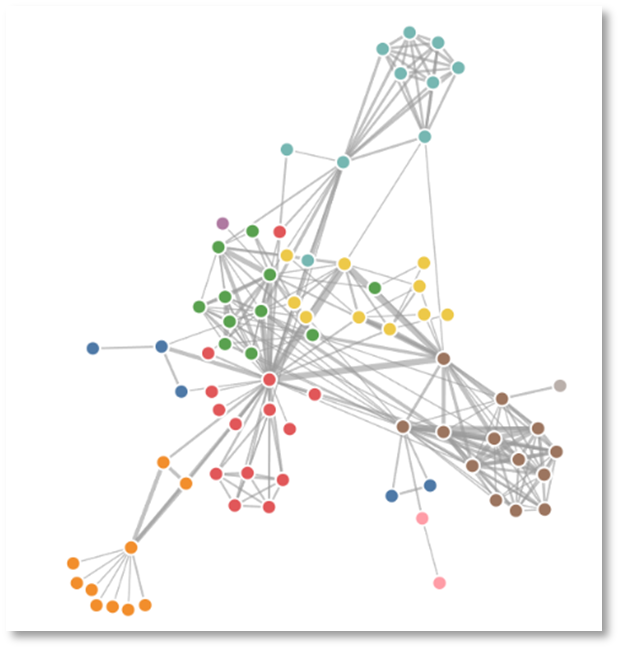
</a> 

  <em>
  Figure 11.  Force directed graph of Les Misérables scenes. Image by Mike Bostock. 
  </em>

Allow me to explain force-directed graphs (FDG) by comparing them with a 2D scatter plot.

A scatter plot presents exact, fixed points in space. The space is cartesian, meaning that each point lines up with values on the the X and Y axes. The value of each point is understood by its position relative to these axes and all the other points.

In contrast, a force-directed graph presents points, or nodes, in space that are not fixed. The space is not cartesian. There are no axes. The value of each point is understood by its position relative to other points that it is connected to, by lines, or edges. The clusters remain generally cohesive, and generally visible, because their positions are calculated with values representing two physical forces, attraction and repulsion.

Since an FDG is less exacting than a scatter plot, you might ask why one would use it. I would argue that since the points are unmoored, they are presented as an animation that the user can change in order to see more. The user can see not just the major relationships, but also the more tenuous ones, based on, for example, the thickness of the lines connecting the points. The animation is also beautiful and engaging.  Aesthetics matter.  

For more on the FDG of Les Misérables, visit [D3](https://observablehq.com/@d3/force-directed-graph-component).  
For more on FDG plots, visit [Wikipedia](https://en.wikipedia.org/wiki/Force-directed_graph_drawing).  

[back to top](#Overview)  

## HNSW
The images are represented in the Weaviate database partially by their feature vectors.  These vectors are stored in Weaviate by the Georgia project, then the Midnight Train application queries the database for vectors similar to a given vector using a nearest neighbor algorithm.  The algorithm used to gather nearest neighbor vectors for a given image is the default algorithm built into the Weaviate vector database.  It is HNSW, or Hierarchical Navigable Small World, which is an approximate similarity algorithm, not an exact one.  For more, see HNSW, in the implementation notes.

[back to top](#Overview)  

## Screen tool Force directed graph kmeans
Here, too, I saw an opportunity.  The relationships animated by an FDG fit perfectly, I thought, with the need to better understand any possible connections between feature vectors generated by the A.I. model.  So, the Midnight Train code fetches the nearest neighbors by querying the Weaviate database’s default search algorithm, HNSW.  The Kmeans colorization is also stored in the database and applied to the FDG circles.  For example, here is a screenshot from Midnight Train, where the circles represent the image vectors, the lines between the circles represent their closest neighbors, and the colors represent their Kmeans groupings.  

<a href="#">
  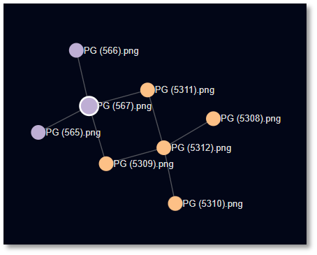
</a> 

  <em>
  Figure 12.  A Midnight Train FDG sample image.  Image by author. 
  </em>

[back to top](#Overview)  

## Histograms and entropy
The images in the OpenCrystalData dataset are grayscale, meaning that the pixels all have values from 0 for black, through 255 for white, with every possible shade of gray in between.  To graph the use of these colors in an image, one can create a histogram, which is a 2D scatter plot.  On the X axis is the color range from 0 to 255. On the Y axis is the number of times each color was in the image.  Histograms can, in one plot, show the pixel color distribution within one image.  Here is an example from Wikipedia.  

<a href="#">
  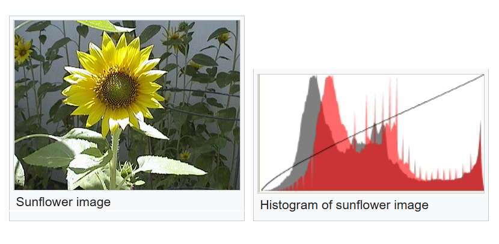
</a> 

  <em>
  Figure 13. Histogram. Image by Wikipedia. 
  </em>

For more, visit [Wikipedia](https://en.wikipedia.org/wiki/Histogram).  

TBD

The probability for the image pixel color appearing is p(i) = h(i) / N.  

Here, p(i) is the probability that a given color will appear; h(i) is the number of times that the color appeared; N is the total number of pixels in the image.  

Entropy is a summary of complexity.  The complexity measured in the OpenCrystalData dataset is the degree of texture complexity in the images.  Entropy summarizes in one number how distributed the pixel color values are within the same image.  

The Shannon entropy formula is  −∑ p(i) log2 p(i). 

The probability calculated above are fractions of the sum of the pixels.  If the probability of the color black appearing is .5, or 50%, then log2(.5) is -1.  However, if the probability of a certain shade of gray appearing is .25, or 25%, then the log2(.25) is -2.  The negative symbol in the Shannon entropy formula turns these values, -1 and -2, positive.  So, the colors that appear less often ‘count’ more when calculating the entropy.  That way, entropy is a measure of how complex an image is. 

For more on the probability and Shannon entropy equations, visit [Shannon](https://jeanvitor.com/image-entropy-value-visualization/).  
[back to top](#Overview)  

## Screen tool Histogram
Midnight Train has a histogram showing the plot for the currently selected image.  Generally, images with histogram shapes that are broader and flatter have higher entropy.  Images with histogram shapes that are narrower, with a simple bell shape, tend to have lower entropy.  In Midnight Train, we have some good examples because the CEX curated images had both the highest and lowest entropy values.  The image CEX (1).png had the lowest entropy value, 5.90.  The image CEX (2).png had the highest entropy value, 7.60.  

<a href="#">
  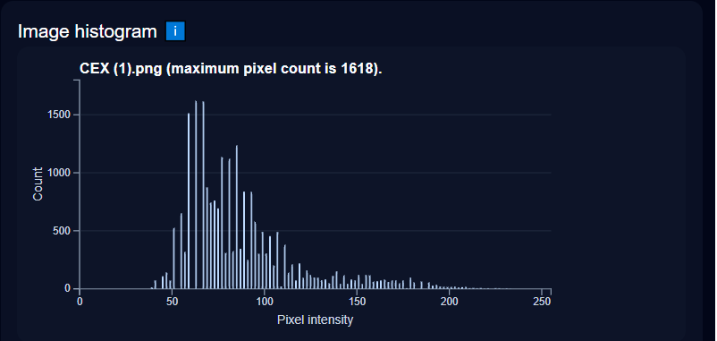
</a> 
Histogram for CEX (1).png.  (image by author)

<a href="#">
  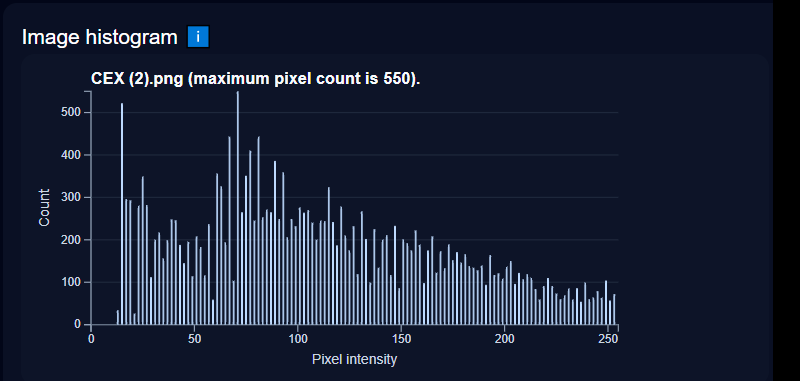
</a> 
Histogram for CEX (2).png.  (image by author)

[back to top](#Overview)  

## Screen tool Entropy 
In Midnight Train, entropy is shown in a 2D scatter plot, where the entropy number per image is on the Y axis in the image below and the name of the image is in the X axis.  The images used in Midnight Train are a curated subset of the image collection.  Approximately four image ‘types’ emerge visually when you look at the total collection.  A handful of images from each type were chosen and used in Midnight Train.  Then the Kmeans group colors are added to the circles below, so that we can see to what extent the entropy per image lines up with the Kmeans groups.  For more, visit Entropy, in the implementation notes.  

<a href="#">
  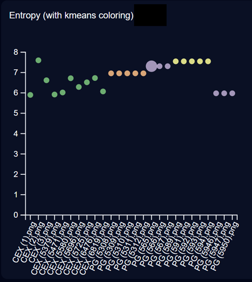
</a> 

The Entropy scatter plot.   (image by author)
[back to top](#Overview)  

## React Tailwind chatGPT Vercel
In the Georgia Project, Python was a perfect and popular choice for training the model, saving data to a database, and presenting plots of the progress.  However, to show the relationships between images, one needs a browser technology that can pull multiple visualization components together in a responsive and animated interface.  React was the answer.  For more, visit [React](https://react.dev/).  

As a companion to React, I wanted a way to style the UI without CSS files, in order to keep development straight-forward.  I chose Tailwind because it removes the need for CSS files, but also because of its popularity.  Many consider Tailwind CSS as the winner in this race.  For more, visit [best css frameworks](https://hackr.io/blog/best-css-frameworks).  

Another companion of the Midnight Train project as been chatGPT.  I have using it to write code snippets, give advice on technology choices, and some background on crystallization.  For more, visit [chatGPT](https://chatgpt.com/).   

Vercel TBD**
For more, visit [Vercel](https://vercel.com/).   

[back to top](#Overview)  

## Quick start instructions
TBD
[back to top](#Implementation)  

## Pseudo 3d images
I looked into the possibility of turning images from the OpenCrystalData dataset into 3D images.  Since the images are not a time-series, a true 3D rendering would not be possible.  

In the past, I had experimented with relief maps algorithms, which would attempt to represent the structure by the geometric clues it picked up in a given image’s texture; i.e., brightness means height, edges mean slopes.  Here is an example from musely.ai website using the image PG (589).png.  I did not find this useful. 
<a href="#">
  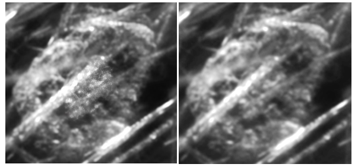
</a> 
Original image on the left.  Relief map from musely.ai website on the right.

Finally, I settled on giving Chat-GPT this same original image and then asked it for a pseudo 3D image of it, using its image generation model, OpenAI’s gpt-image-1.  I found the results interesting, as seen below.  Importantly, the image generated is an A.I. hallucination and non-deterministic.  Every request for the image can produce a somewhat different result.  On the other hand, the image generator made the circular “disk” in the image more prominent, by making it appear raised.  This disk is arguably phenylglycine.

<a href="#">
  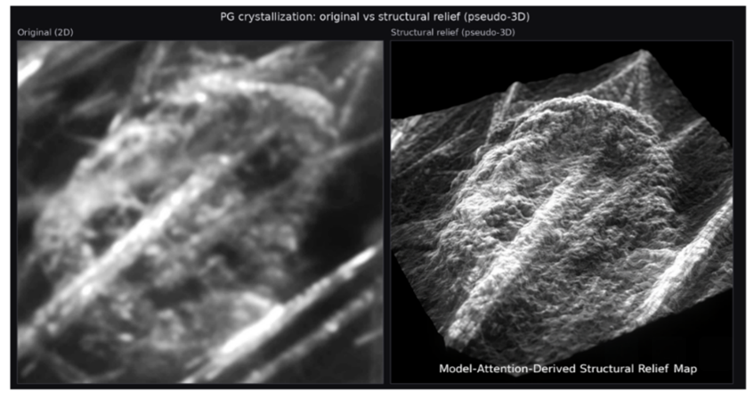
</a> 
Original image on left.  Image on right was generated by OpenAI’s gpt-image-1.

While this was a fun romp, I did not think any of this should be put in Midnight Train.  Maybe someone else sees potential here.  
[back to top](#Implementation)  

## PCA in 3D
After finishing most of Midnight Train, I decided to experiment with a 3D PCA plot.  I had already done it in 2D, as seen above.  When I experimented with doing 3D PCA with Kmeans, I found that approximately 25% of the images jumped to another Kmeans group.  In other words, some of the circles that represent the images defected to other Kmeans groups, thereby taking on a different Kmeans color.  While this was intriguing, I then had to face the prospect of two Kmeans color schemes:  one for 2D and one for 3D in the same app.  I was worried about the user interface experience becoming tiresome.  I want to shelve this idea for a later date.  
[back to top](#Implementation)  

## Entropy
The algorithm used in the Georgia Project to calculate the entropy per image is skimage.measure shannon_entropy.  It is widely used for image processing.  
For more, visit [skiimage.measure](https://scikit-image.org/docs/stable/api/skimage.measure.html#skimage.measure.shannon_entropy).  

The header of each image file in the OpenCrystalData dataset has a date and time stamp in it.  I don’t know if that date and time stamp was created during the crystallization, or later, when someone created the cropped images from the full images.  However, the time frames of the stamps for CEX and PG images are different.  

It is possible that there were different camera settings and/or lighting when the images were taken.  Images can be influenced by these differences, so entropy can be too.  One would like to think that the entropy values shown in the Midnight Train Entropy scatter graph reveal something about the structure of the crystallization, but it might at least be influenced by extraneous conditions and not crystal growth.  

For those how want to take this further, here is some code that walks through the steps to prepare data for a histogram plot and then calculate entropy. 

Step 1.  Loop through all the pixels in an image.  Count how many times each color was used.  Put those counts in freqMap. 

Step 2.  Loop through the pixel color counts and divide each one by the total number of pixels in the image.  The result is the probability of a color being in the picture.*  Then apply the Shannon entropy formula:  H = −∑ p(i) log2p(i).**

// Count frequency of each character 
const freqMap = {}; 
for (const char of input) { 
   freqMap[char] = (freqMap[char] || 0) + 1; 
}

// Calculate probabilities and entropy 
let entropy = 0; 
const len = input.length; 

for (const char in freqMap) { 
   const p = freqMap[char] / len; // calculate the probability.* 
   entropy -= p * Math.log2(p);   // calculate the entropy for the image.** 
}
[back to top](#Implementation)  

## Flow
General flow of the code.  
page.tsx (pulls data from the database and passes it to the DataExplorerClient)
	DataExplorerClient 
                 <MetaProvider>
                    <LogProvider>
                       <SelectionProvider>
		ImageGallery 
		GraphForceDirected
                             GraphHistogram
		GraphScatterKmeans
		GraphScatterEntropy
		CamAccordion 
		ImageSlider
		LogPanel

[back to top](#Implementation)  

## HDSW
HNSW, or Hierarchical Navigable Small World, is the default nearest neighbor algorithm used in the Weaviate database.  It is used when creating the Kmeans/PCA plot in Midnight Train, as pictured below. 

When a new vector is inserted into the database, HNSW will not do all the math to map the relationships among all the vectors in the Weaviate database, out of brevity.   So, it trades accuracy for time efficiency.  Also, the search can vary, often starting with the most recently added vector, but not necessarily there.  So, both the “incomplete math homework” and the “random adjacent” search starting point make the HNSW algorithm non-deterministic; i.e., the order of queries initiated by the user when they click an image in Midnight Train can affect which nearest neighbors are fetched.  In other words, the order in which the user clicks on images in the Image Gallery, and elsewhere in the UI, might change the relationships depicted by the edges in the force directed graph. 

HNSW does, however, have a ~95% accuracy rate.  How does one have confidence that it is accurate enough?  The Kmeans/PCA scatter graph, on the right below, in Midnight train is effectively a cross-check.  The sklearn PCA algorithm it uses is deterministic.  If I click and drag the clusters in the FDG (left) like they arrange themselves in the Kmeans/PCA scatter graph (right), I get largely the same organization, as seen below. 
<a href="#">
  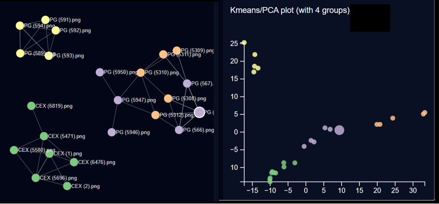
</a> 
On the left is a force directed graph, which uses non-deterministic HNSW to find nearby images. 
On the right is a Kmeans/PCA 2D scatter plot, which uses the deterministic sklearn PCA to find nearby images.  (Images by author) 
For more, visit [sklearn](https://scikit-learn.org/stable/modules/generated/sklearn.decomposition.PCA.html).  
[back to top](#Implementation)  

## Image slider notes
The ImageSlider is a component that uses D3.js.  It subscribes to Midnight Train’s SelectionContext, so that it can update when the user selects a new image to study.  The CAM overlay counterpart images were generated by the Georgia Project and stored in the /images_testing/CEX/ folder or the /images_testing/PG/ folder, depending on the classification of the currently selected image.  
This component uses D3.js to control the drag event, so that when users click on the handle of the slider bar, the CAM overlay image is clipped to the new position, and the slider bar and its handle are rendered at the same vertical position. 
 

The CEX and PG CAM Overlays accordions.   (image by author)
[back to top](#Implementation)  

## Log
The log component allows for better debugging.  The components send messages to it and the LogPanel.tsx will display them.  When Midnight Train first launches, the log is not visible.  Click the button at the bottom of the UI to see it.  

Click this button…
<a href="#">
  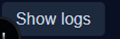
</a> 

…to see the log entries. 
<a href="#">
  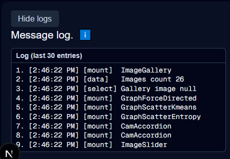
</a> 
(images by author)
[back to top](#Implementation)  

## CAM generation
First, one needs to select a convolutional layer of the model to query.  Early layers usually depict small features of an image, while later layers depict bigger features.  Generally, later layers create larger CAM areas.  I tried several later layers and settled on one, "conv5_block2_out".

Second, one needs to pick a color scheme and opacity level.  I chose pink and purple.  The opacity level is set at .5, so that half of the original image shows through the CAM image when creating the CAM overlay image.  The percentage to colorize is set to the top 16% by weight.  I came to these adjustments through trial and error, aiming to find a combination that created the most distinct CAM overlays. 

Then, one would create a model by loading the weights file created by the Georgia Project.  The images are opened and the features of the selected layer queried.  The resulting feature map is applied to the color scheme to create a CAM image.  The CAM image is overlaid on the original image to create the CAM overlay image.  

CAM overlay weights notes.
A confidence percentage returned from the model with all layers is a measure of how 'confident' the model is that a given image has PG in it.  In contrast, the data return from a single layer for a given image, during the CAM creation process, may or may not contribute to the final classification.  It just tells us which features contributed positively at that layer in the model.  Therefore, the classification from the model, with all layers, is used to interpret the features activated in the selected layer.  

Convolutional layers later in the model’s structure are larger, so they tend to concentrate on the center of the image and less on the border.  When the percentage of colorization goes towards 100%, a rectangle tends to form in the center of the image.  A uniform rectangle can mean that the region was uniformly CEX or uniformly PG, but this is up for interpretation.  In contrast, heterogeneous CAM images highlight competing structures, as seen in PG images.  

The CAM overlays for the images labeled by the model as CEX and some of the PG labeled images have a common structure.  They both form a fairly consistent rectangle in the center of the image.  However, in both image types, the top part of the rectangle is less consistently blocky than the bottom part.  This could be an artifact of the model or of the imaging, but probably not of the crystal growth.  

CAM overlays are only as meaningful as the model’s ability to predict accurately.  Because the model in the Georgia Project had high scores in its prediction, we can be confident that the CAM overlays produced reflect the model’s classification focus.  

If there is interest in taking this further, there are several places to adjust this process to create different looking CAM overlays. 

- change the convolutional feature layer
- change the color scheme
- edit the percentage of the image that gets colorized
- edit the opacity percent when creating overlay  
[back to top](#Implementation)  

## JSON files
One of the goals of the Midnight Train project is to explore the Weaviate database for A.I.  Since installing the database might not be of interest to everyone, I added an alternative data source, JSON files.  They are part of the Midnight Train project files, so they are a reliable backup to the database.  They are three file under lib/data:  fdg_links.json, fdg_nodes.json, and crystals.json. 
[back to top](#Implementation)  

## Weaviate database
Weaviate is an open-source vector database, available on GitHub. I downloaded the GitHub zip file, installed it, then ran it in a Docker container on my Win 10 pc. I found the setup fairly straightforward. The code in python to control the database bears no resemblance to scrSQL code, but I still found that writing the WeaviateDatabase class was fun.  Weaviate seemed pretty accommodating, in that it did not expect me to set up a table with a data type that handles vectors, nor did it expect me to study its many nearest neighbor search algorithms and explicitly ask for my favorite. It felt like the engineers at Weaviate know that developers are hoping to set up and use the database with minimum work, at least at the outset of a project.

For those of you who have worked with SQL databases, and not vector databases, let me mention that the terminology is a bit different, as seen here.  The change in terminology makes me laugh. 

SQL database term   	Vector database term
table			class
record			object
field			property
vector field		vector embedding  
primary key		UUID
fetch, select		GraphQL query 

For more on Weaviate, visit [Weaviate](https://weaviate.io/).  
For more on Weaviate on Github, visit [Weaviate on Github](https://github.com/weaviate/weaviate).  
For more on Weaviate in the Georgia Project, visit [Weaviate Georgia Project](https://github.com/KatherineMossDeveloper/The-Georgia-Project/blob/main/docs/maindoc.md#f7).  
[back to top](#Implementation)  

## The license.  
This project is licensed under the MIT License.  See the license.txt file for details [here](../LICENSE).  
[back to top](#Implementation)  

## Contact info.                                                                     
For more details about this project, feel free to reach out to me at katherinemossdeveloper@gmail.com or my account on [LinkedIn](https://www.linkedin.com/pub/katherine-moss/3/b49/228) .  
My time zone is EST in the U.S.
[back to top](#Implementation)  

## Entropy Reveals Structured Variation

Entropy provides a quantitative measure of texture complexity by analyzing the distribution of pixel intensities within each image.

In the OpenCrystalData dataset, entropy reveals a surprising structure: while CEX images cluster tightly, PG images form distinct vertical alignments—what we informally call "little soldiers." These groupings closely mirror patterns observed in both PCA/k-means clustering and the force-directed graph (FDG), reinforcing that entropy captures meaningful structural differences.
	  

    

  <em>
  Figure 8. Entropy scatter plot. Image by author. Data source: OpenCrystalData.
  </em>

